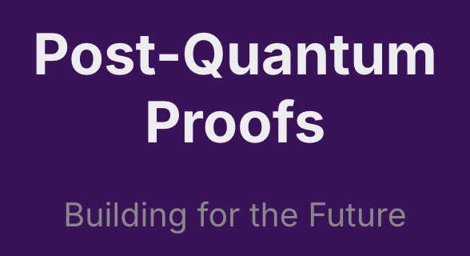

# Post-Quantum Proofs




### Background
Post-quantum signatures are a crucial aspect of post-quantum cryptography (PQC), which aims to develop cryptographic algorithms that remain secure against the potential threats posed by quantum computers. As quantum computing technology advances, it is anticipated that many widely used cryptographic systems, particularly those based on integer factorization and discrete logarithm problems, will become vulnerable to attacks using algorithms like Shor's algorithm. Therefore, the development of quantum-resistant signature schemes is essential for ensuring long-term data security.

### Problem
In quantum computing, a possible Q-day attack would be a hypothetical cyberattack, similar to zero-day vulnerabilities in the security field. If this hypothetical were to become reality, the signatures created would verify the validity of these onchain cryptographic encryptions.

### Idea
Post-quantum signatures are digital signatures designed to be secure against attacks from quantum computers. These signatures rely on mathematical problems that are believed to be difficult for quantum computers to solve. The objective is to create a signature scheme that allows a signer to produce a signature using a private key while enabling anyone with access to the corresponding public key to verify the authenticity of the signature without revealing the private key. We implemented a post-quantum lattice-based digital signature on a trusted execution environment as a proof of concept of PQ in Web3.

### Run
```
docker compose up --build
```