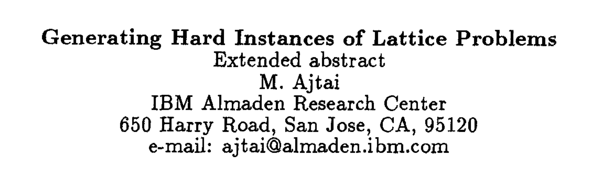

# Post-Quantum Proofs

<p align="center">

</p>

### Background
Post-Quantum Proofs (PQP) aims to build a quantum resistant future. 
Our mission is to implement cryptographic algorithms that remain secure against the potential threats posed by quantum computers, to create a robust Web3 infrastructure. As quantum computing technology advances, it is anticipated that many Web3 protocols which use cryptographic systems, particularly those based on integer factorization and discrete logarithm problems, will become vulnerable to attacks using algorithms like Shor's algorithm. Therefore, the development of quantum-resistant signature schemes is essential for ensuring long-term blockchain security.

### Problem
In quantum computing, a possible Q-day attack would be a hypothetical cyberattack, similar to zero-day vulnerabilities in the cybersecurity field. If quantum technology matures, blockchain protocols and Web3 transactions will become vulnerable to quantum algorithms. Moreover, many of the underlying cryptographic primitives would become vulnerable to quantum attacks.

### Idea
Post-quantum signatures are digital signatures designed to be secure against attacks from quantum computers and can verify the validity of onchain cryptographic encryptions. These signatures rely on mathematical problems that are believed to be difficult even for quantum computers to solve. The objective is to create a signature scheme that allows a signer to produce a signature using a private key while enabling anyone with access to the corresponding public key to verify the authenticity of the signature without revealing the private key. We implemented a post-quantum lattice-based digital signature on a trusted execution environment as a proof of concept of PQ in Web3.

### Run
```
docker compose up --build
```



